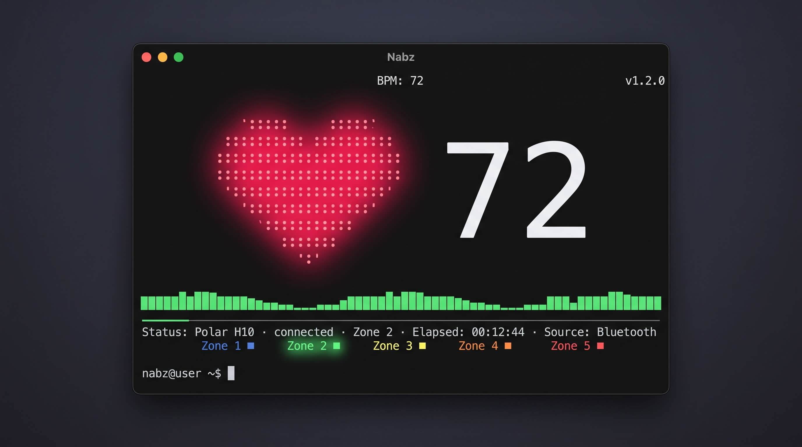
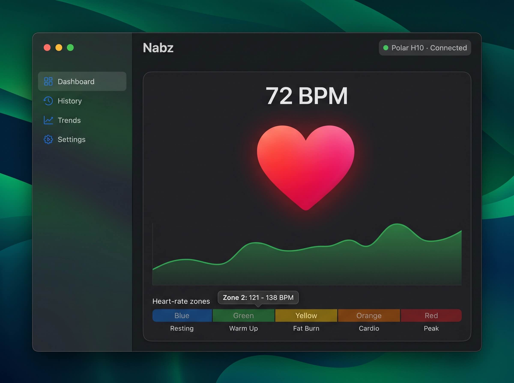
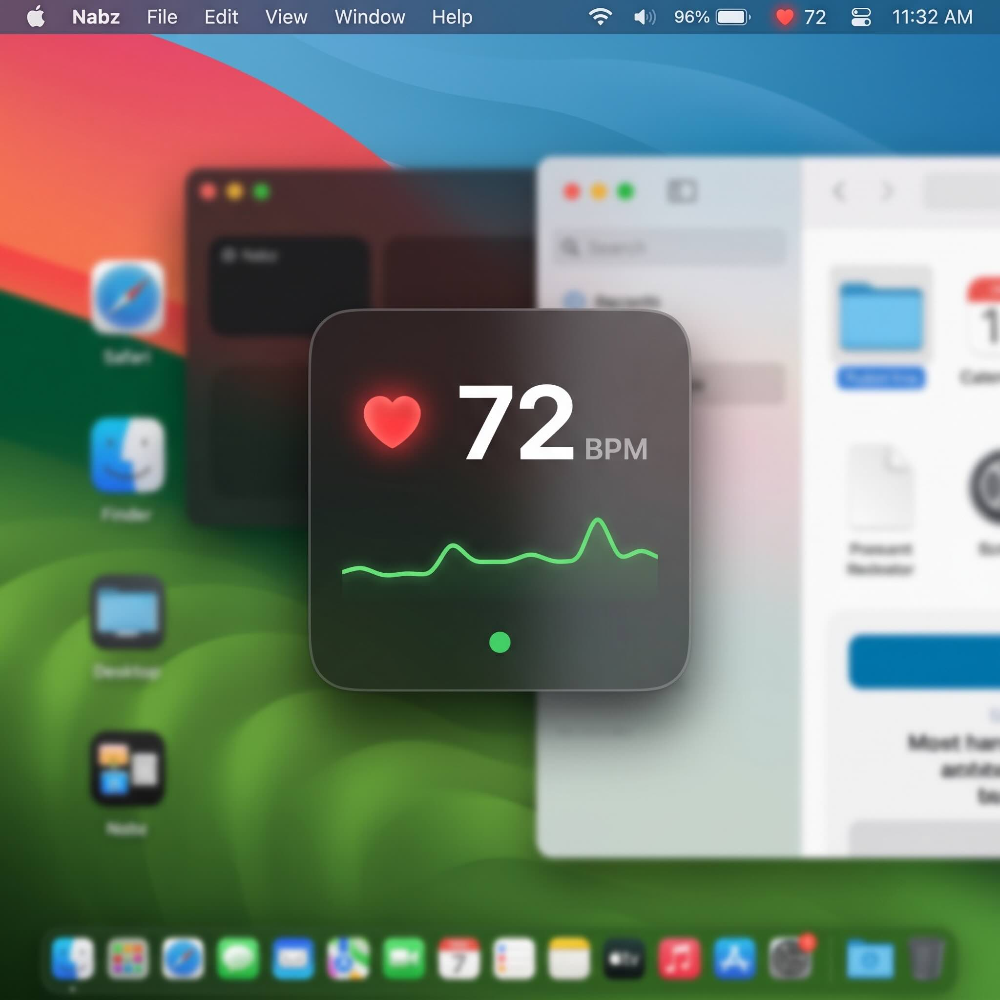

# Nabz

**Nabz** (نبض, "pulse") is a native macOS app that connects to a Bluetooth heart-rate monitor (primary target: **Polar H10**) and shows your live heartbeat — a beat-synced animation, a large BPM readout, a rolling trend, and heart-rate-zone coloring.

The first release is a polished terminal (TUI) experience; a SwiftUI app and a desktop menu-bar/floating readout follow in later phases, all sharing one UI-agnostic core (`NabzCore`).

See [Nabz-PRD.md](./Nabz-PRD.md) for the full product requirements.

## UI Preview

> ⚠️ **Prototype only.** The images below are early design mockups to convey the intended look and feel. They are **not** the final UI and do not reflect the shipping product. They contain known inconsistencies (zone labels, zone math, the "widget" framing) — PRD **§7b Design Language** is canonical and supersedes them.

### Terminal (Phase 1)

### Desktop app (Phase 2)

### Floating desktop readout (Phase 3)

*(Rendered as a floating always-on-top panel + menu-bar item — not a WidgetKit widget; see PRD R-5.)*

## Status

Draft — see [Nabz-PRD.md](./Nabz-PRD.md) for scope and decisions, [ROADMAP.md](./ROADMAP.md) for the execution order, and [specs/](./specs/) for the Phase-1 spec set.
